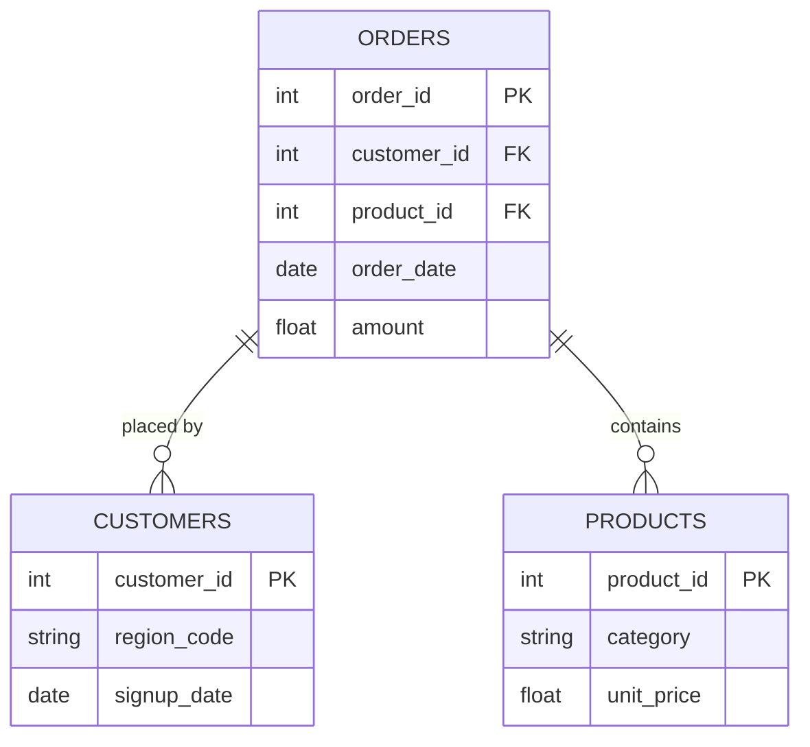

# What factors are associated with customer churn, and what actions should the bank take to improve customer retention?
Business problem: The bank has seen an increase in customer attrition over the past year. Senior management wants to understand which customers are leaving and identify strategies to improve retention.


---

## ⚙️ Project Type Flags
> *Check what applies. This helps reviewers and collaborators understand the nature of the work at a glance. Delete this block before publishing.*

- [ ] Exploratory Data Analysis (EDA)
- [ ] SQL Analysis / Querying
- [ ] Dashboard / Data Visualization
- [ ] Data Pipeline / ETL
- [ ] Predictive Modelling / Machine Learning
- [ ] Data Cleaning / Wrangling
- [ ] End-to-End (multiple of the above)
- [ ] Other: ___________

---

## Table of Contents
1. [Project Overview](#1-project-overview)
2. [Objectives](#2-objectives)
3. [Project Scope & Tools](#3-project-scope--tools)
4. [Repository Structure](#4-repository-structure)
5. [Data Workflow](#5-data-workflow)
6. [Data Model & Schema](#6-data-model--schema)
7. [ERD - Entity Relationship Diagram](#7-erd--entity-relationship-diagram) *(SQL projects)*
8. [Analysis & Metrics](#8-analysis--metrics)
9. [Key Insights](#9-key-insights)
10. [Recommendations](#10-recommendations)
11. [Assumptions & Limitations](#11-assumptions--limitations)
12. [Future Enhancements](#12-future-enhancements)
13. [Deliverables](#13-deliverables)
14. [Author](#14-author)

---

## 1. Project Overview

**Context:** A mid-sized bank experienced a noticeable increase in customer attrition over the previous 12 months but lacked a clear understanding of which customers were leaving and why. Management required a better understanding of which customers were leaving and the factors associated with churn.

**Problem Statement:** What factors are associated with customer churn, and what actions should the bank take to improve customer retention?

**Approach:** Customer data was analysed using SQL to calculate churn rates, Segment customers by demographic, behavioural and financial characteristics, and identify high-risk customer groups.

**Outcome:** The analysis identified several customer characteristics associated with higher churn, including age, inactivity, product ownership and account balance. The final deliverable was an interactive dashboard that provides management with actionable insights to prioritise customer retention initiatives


---

## 2. Objectives

 **Primary Objective:** Measure the overall churn rate and identify the key factors associated with customer attrition.
- **Secondary Objective 1:** Identify the characteristics of customers who are most likely to churn
- **Secondary Objective 2:** Compare the financial profiles of churned and retained customers
- **Secondary Objective 3:** Identify high-risk customer segments to prioritise retention efforts.
- **Secondary Objective 4:** Recommend data-driven actions to improve customer retention
---

## 3. Project Scope & Tools

### Scope

| Dimension | Details |
|-----------|---------|
| **In Scope** | Customer-level data for 10,000 bank customers across France, Germany and Spain. Analysis covers customer demographics, behaviour, financial characteristics, churn rates and high-risk customer segments.
| **Out of Scope** | Transaction-level activity, customer acquisition data and historical churn trends were excluded because the supplied dataset is a customer-level snapshot and does not contain transaction dates or longitudinal customer records. Individual customer-level analysis was also excluded; 'CustomerID' and 'Surname' were not required for the group-level churn analysis. |
| **Time Period** | No transaction date or historical time period is provided in the dataset. |
| **Granularity** | Customer level, with one row representing one customer and 10,000 records in total.|

### Tools & Technologies

| Category | Tool(s) Used |
|----------|-------------|
| Data Storage |  CSV files |
| Data Processing |  SQL, Excel |
| Analysis | custom SQL queries |
| Visualisation |  Power BI |
| Version Control | GitHub |
| Documentation |  Markdown, Notion] |

---

## 4. Repository Structure

```
[project-root]/
│
├── data/
│   ├── raw/                  # Original, unmodified source data - never edited
│   ├── processed/            # Cleaned and transformed data
│   └── external/             # Reference data, lookup tables, third-party files
│
├── notebooks/                # Jupyter, R Markdown, or Colab notebooks
│
├── scripts/                  # Reusable .py, .R, or .sh processing files
│
├── queries/                  # SQL files (retain this folder for SQL-heavy projects)
│   ├── exploratory/          # Ad-hoc or investigative queries
│   ├── transformations/      # Cleaning and reshaping logic
│   └── final/                # Production-ready or presentation queries
│
├── reports/                  # Final outputs: PDFs, slide decks, Word docs
│
├── visuals/                  # Exported charts, dashboard screenshots, ERD diagrams
│
├── docs/                     # Data dictionaries, schema notes, reference material
│
├── project_metadata.yml      # Machine-readable metadata (optional)
└── README.md                 # You are here
```

> ⚠️ *Delete folders you didn't use. An empty folder is worse than no folder.*
> SQL-heavy projects: keep `queries/`. Analysis-only projects: keep `notebooks/`. Both? Keep both.

---

## 5. Data Workflow

-->

```
[Kaggle CSV Dataset]
10,000 bank customers
      ↓
[MySQL Ingestion]
CSV imported into `customers` table
      ↓
[Cleaning & Transformation]
Data validation - Binary labels - Customer groupings
      ↓
[SQL Analysis]
Churn KPIs - Hypothesis testing - Segmentation - Financial analysis
      ↓
[Power BI]
Interactive dashboard - key insights - retention recommendations
```

1. **Source:** Bank Customer Churn Prediction Dataset downloaded from Kaggle. One CSV file containing 10,000 customer records across three countries (France, Germany and Spain), with demographic, behavioural and financial attributes.
2. **Ingestion:** Imported the CSV into MySQL using the Table Data Import Wizard. Data was stored in a relational table and queried using SQL before being imported into Power BI for visualisation.
3. **Cleaning:** Validated the dataset for missing values and duplicate records. Removed non-analytical fields (CustomerId and Surname) as they were not required for customer segmentation or churn analysis. Verified data types and binary variables (0/1) for consistency.
4. **Transformation:** Converted binary fields into descriptive categories (e.g. Stayed/Churned, Active/Inactive, Credit Card Yes/No). Created age, balance and income groups to support customer segmentation. Calculated churn metrics and summary statistics for demographic, behavioural and financial analysis.
5. **Analysis:** Query-based analysis using SQL with descriptive statistics (counts, averages, medians and percentages) to measure churn, compare customer segments and identify high-risk groups.
6. **Output:** Summary report (Power BI), processed CSV

---

## 6. Data Model & Schema

### Dataset / Table: `Customers`

| Field Name | Data Type | Description | Example Value |
|------------|-----------|-------------|---------------|
| `CustomerId` |  INT |Unique identifier for each customer| 15634602 |
| `CreditScore` | INT | Customer credit score | 619 |
| `Geography` | VARCHAR | Customer's Country | France |
| `Gender` | VARCHAR| Customer gender| Female|
| `Age` | INT| Customer age |42|
|`Tenure` | INT | Years as a customer | 2 |
| `Balance` | DECIMAL | Current account balance |83807.86|
|`NumOfProducts`| INT | Number of products held | 2 |
| `HasCrCard` | BOOLEAN (0/1) | Credit card ownership | 1 |
| `IsActiveMember` | BOOLEAN (0/1) | Active membership status | 1 |
| `EstimatedSalary` | DECIMAL | Estimated annual salary (£) | 101348.88|
| `Exited` | BOOLEAN (0/1) | Customer churn indicator | 1 |

> **Row count (approx.):** 10,000 rows
> **Date range:** Not applicable
> **Key join / relationship:** None (single-table dataset)
> **Primary Key** CustomerId


---

## 7. ERD - Entity Relationship Diagram
### *(Primarily for SQL Projects - remove this section if not applicable)*

<!--
  An ERD shows how your tables connect to each other visually.
  It is the fastest way for a reviewer to understand the data structure
  of a SQL project without reading every query.

  HOW TO INCLUDE YOUR ERD:
  Option A - Image embed (most common):
    Export your ERD from dbdiagram.io, DBeaver, Lucidchart, or similar.
    Save to /visuals/erd.png and reference it below.

  Option B - dbdiagram.io code block (version-controllable):
    Paste your schema definition code directly in the fenced block below.
    Anyone can paste it into dbdiagram.io to regenerate the visual.

  Option C - Mermaid diagram (renders natively in GitHub):
    Use the mermaid code block syntax below.
    GitHub will render this as a diagram automatically.

  PICK ONE. Don't use all three. Delete the options you don't use.
-->

### Option A - Embedded Image

*[Brief caption: e.g., "Three-table schema - orders, customers, and products joined on shared IDs."]*

---

### Option B - dbdiagram.io Schema Definition
```
Table orders {
  order_id    int     [pk]
  customer_id int     [ref: > customers.customer_id]
  product_id  int     [ref: > products.product_id]
  order_date  date
  amount      float
}

Table customers {
  customer_id int  [pk]
  region_code string
  signup_date date
}

Table products {
  product_id   int    [pk]
  category     string
  unit_price   float
}
```
*Paste this into [dbdiagram.io](https://dbdiagram.io) to view the visual.*

---

### Option C - Mermaid Diagram *(renders on GitHub)*


---

**Table Relationships Summary:**

| Relationship | Join Key | Type |
|-------------|----------|------|
| `orders` → `customers` | `customer_id` | Many-to-One |
| `orders` → `products` | `product_id` | Many-to-One |
| [Add rows as needed] | | |

---

## 8. Analysis & Metrics

### Analytical Approach
This project used exploratory and descriptive analysis to investigate the factors associated with customer churn. SQL was used to establish the overall churn baseline before comparing churn rates across demographic, behavioural and financial customer segments.

The analysis began by testing the hypothesis that customers with less than one year of tenure would have a higher churn rate, before expanding into broader demographic factors such as age, geography and gender and behavioural factors including tenure, product ownership and membership activity.

Financial characteristics were then analysed by comparing churned and retained customers and examining churn rates across different balance groups. Finally, multi-factor segmentation was used to identify high-risk customer groups and translate the findings into targeted retention recommendations.


### Key Metrics Defined

| Metric | Plain-Language Definition | Why It Matters |
|--------|--------------------------|----------------|
| `Overall Churn Rate` | Percentage of all customers who exited the bank. | Establishes the 20.37% baseline against which customer segments can be compared.
| `Segment Churn Rate` | Percentage of customers within a specific group who churned. | Identifies demographic, behavioural and financial groups with above-average churn. |
| `Churned Customers` | Number of customers who exited the bank. | Shows the actual volume of customer attrition alongside percentage rates. |
| `Average Customer Balance`| Mean account balance across customers| Provides an overview of the financial value held within the customer base.|
| `Balance Held by Churned Customers` | Total account balance associated with customers classified as churned. | Indicates the potential financial significance of customer attrition, without assuming the full balance was lost by the bank.|
| Median Estimated Salary | Middle estimated salary when customers are ordered by salary. | Allows comparison between churned and retained customers while reducing the influence of extreme salary values.|
|`Average Credit Score`| Mean credit score within a customer group. | Helps determine whether credit profile differs meaningfully between retained and churned customers.|

### Methods Used
Descriptive statistics — counts, percentages, averages and medians.
Segmentation analysis — compared churn across demographic, behavioural and financial customer groups.
Churned vs retained comparison — compared the financial profiles of customers who stayed and exited.
Multi-factor analysis — combined product ownership and membership activity to identify high-risk segments.
SQL aggregation and conditional logic — used COUNT(), SUM(), AVG(), CASE and GROUP BY to produce analytical outputs.
.
## 9. Key Insights

**Insight 1: [Middle-aged customers represent the highest churn risk]**
Customers aged 50-59 recorded the highest churn rate at 56%, considerably above the 20.37% overall churn rate. Churn was also elevated among customers aged 40-49 and 60-69, suggesting retention efforts should place greater focus on middle-aged and older segments.

**Insight 2: [Customer engagement is strongly associated with retention.]**
Inactive members recorded a 27% churn rate compared with 14% for active members, making inactivity one of the clearest behavioural factors associated with churn. This implies increasing customer engagement could be an important opportunity for improving retention.

**Insight 3: [Geography matters, while credit card ownership appears to have little influence]**
Germany recorded a 32% churn rate, approximately twice the rate observed in France and Spain (around 16-17%). In contrast, churn was almost identical between customers with and without a credit card (20% vs 21%), illustrating ownership alone is not an important differentiator of churn.

**Insight 4: [Product ownership and activity identify an actionable high-risk segment]**
The deeper segmentation analysis found that single-product, inactive customers consistently experienced higher churn than active and multiproduct customers, making this a priority group for retention initiatives. Some customers holding four products recorded churn rates of up to 100%, but these segments contained relatively few customers and should therefore be interpreted cautiously.

**Insight 5: The tenure hypothesis was only partially supported.**
The analysis initially hypothesised that newer customers would be more likely to churn. Customers with zero years of tenure did show elevated churn at approximately 23%, but churn did not consistently decline as tenure increased and fluctuated throughout the customer lifecycle. This shows that tenure alone is not a strong indicator of churn and should be considered alongside other customer characteristics.

**Insight 6: Customer balance is associated with differences in churn risk.**
Churn varied considerably across balance groups, with customers holding £1–£49,999 showing the highest churn rate at approximately 35%, compared with approximately 14% among zero-balance customers. Churned customers also held a higher average balance than retained customers, suggesting that customer attrition may have financial significance beyond the number of customers lost.


---

## 10. Recommendations

<!--
  Action-oriented. Addressed to a real audience.
  Tied explicitly to the insight that supports each one.

  WHAT GOOD LOOKS LIKE:
  Priority: High
  Recommendation: "Conduct a fulfilment audit for home goods deliveries
                   in Region A - specifically investigating whether returns
                   correlate with a particular warehouse, carrier, or SKU batch."
  Based On: Insight 1 - return rate anomaly in Region A
  Owner: Operations / Supply Chain team

  WHAT TO AVOID:
  ❌ "Improve the return rate."
     (Not actionable. Doesn't say who, how, or where to start.)
  ❌ "Further analysis is needed."
     (This is a placeholder, not a recommendation.)
-->

| Priority | Recommendation | Based On | Suggested Owner |
|----------|---------------|----------|-----------------|
| High | [Specific, actionable step] | [Insight it comes from] | [Who should act] |
| Medium | [Specific, actionable step] | [Insight it comes from] | [Who should act] |
| Low | [Exploratory or longer-term suggestion] | [Insight it comes from] | [Who should act] |

---

## 11. Assumptions & Limitations

<!--
  WHAT GOOD LOOKS LIKE:
  Assumption: "Transaction records were assumed to be complete for all five regions.
               No validation was performed against source system record counts."
  Limitation: "The analysis cannot distinguish between returns initiated by
               the customer vs. returns initiated by the business (e.g., recalls).
               If business-initiated returns are concentrated in Region A, the
               return rate finding may reflect a policy decision, not a quality issue."

  WHAT TO AVOID:
  ❌ Leaving this section blank or writing "None known."
     Every project has limitations. Documenting them is a sign of
     analytical maturity - not a confession of failure.
-->

### Assumptions
- [What did you treat as true without being able to verify?]
- [What simplifications did you make for scope or feasibility?]
- [What domain rules or definitions did you accept as given?]

### Limitations
- [What gaps exist in the data?]
- [What analysis was out of scope but could affect interpretation?]
- [What would a more rigorous version of this project include?]
- [Are there known biases in the data source or collection method?]

> *The goal here is pre-emptive Q&A. What would a thoughtful skeptic push back on? Document the answer here, before they ask.*

---

## 12. Future Enhancements

<!--
  WHAT GOOD LOOKS LIKE:
  ✅ "Automate the monthly data pull from the POS export folder using
      a scheduled Python script, replacing the current manual process."
  ✅ "Expand the return rate analysis to include carrier-level data,
      which was unavailable in this dataset but exists in the logistics system."

  WHAT TO AVOID:
  ❌ "Add a machine learning model."
     (Vague, and disconnected from the actual findings of this project.)
  ❌ Listing aspirational features that don't follow logically from the work.
-->

- [ ] [Enhancement 1 - specific and traceable to a real gap in this project]
- [ ] [Enhancement 2]
- [ ] [Enhancement 3]
- [ ] [Enhancement 4]

---

## 13. Deliverables

| Deliverable | Description | Location |
|-------------|-------------|----------|
| [Name] | [What it contains] | [`/path/to/file`] |
| [Name] | [What it contains] | [`/path/to/file`] |
| [Name] | [What it contains] | [`/path/to/file`] |

---

## 14. Author

**[Your Name]**
[Your role or title - current or target]

- 🔗 [LinkedIn URL]
- 💼 [Portfolio or GitHub profile URL]
- 📧 [Email - optional]

---

*Last updated: [Month YYYY]*
*If this template helped you, consider starring the repository.*
